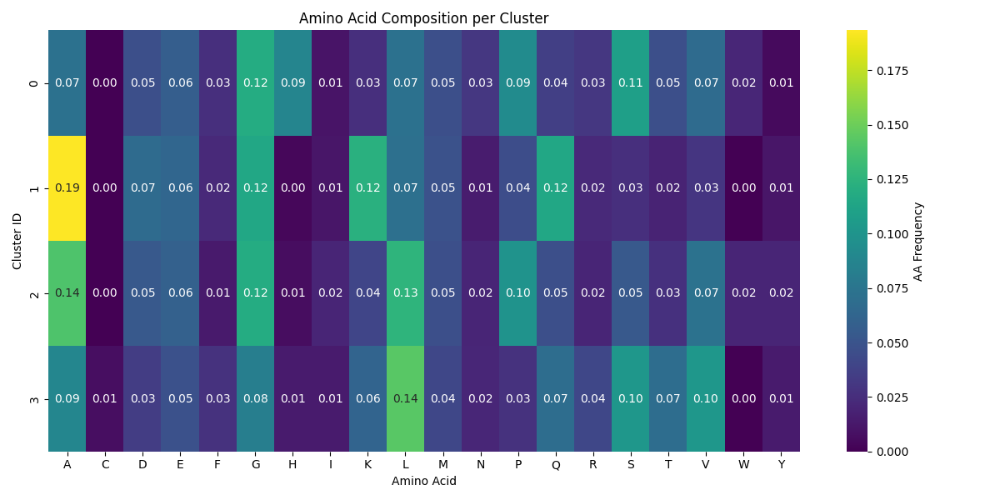
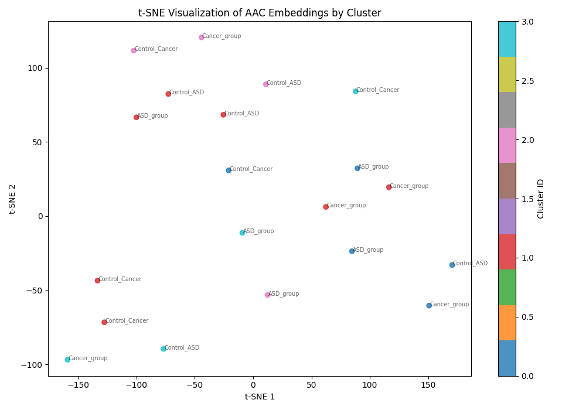
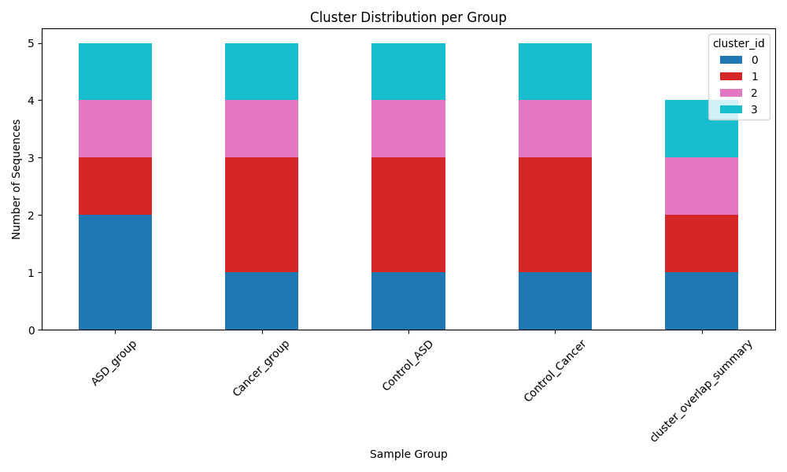
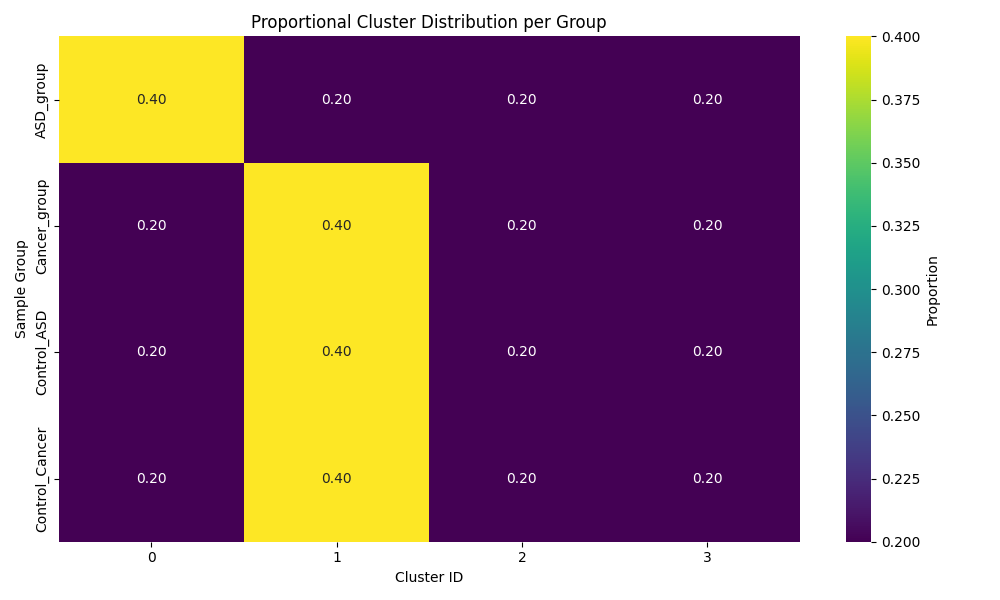
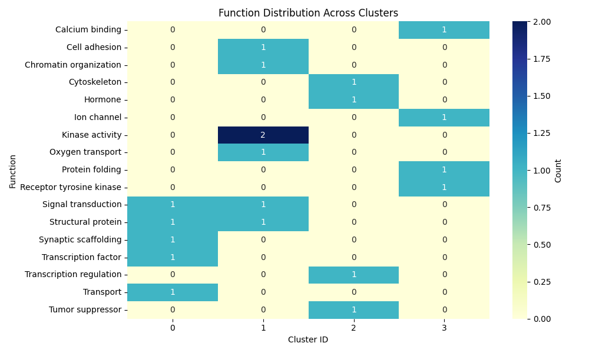
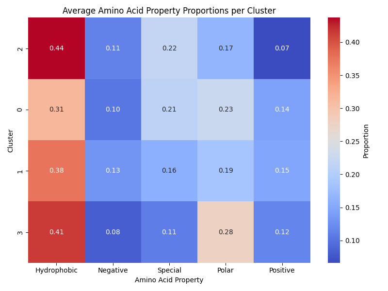

# 🧬 PathoCore: Structural Core Gene Clustering from Protein Sequences

##  Acknowledgments
This project is inspired by the excellent work of the **Steinegger Lab**, particularly their tool **Unicore**.
Unicore identifies structural core genes across taxa using ProstT5-based 3Di string representations and Foldseek clustering,
bridging deep evolutionary gaps beyond amino acid similarity. This project builds on a simplified concept of structural
core gene clustering by using **Amino Acid Composition (AAC)** embeddings and simulates how lightweight analysis can be performed
in early stages of metagenomic or comparative protein research. ChatGPT played a major role in helping design, write, and explain the codebase, figures and texts.

---

## 📘 Overview
**PathoCore** is a lightweight bioinformatics pipeline that clusters protein sequences based on their amino acid composition,
then analyzes and visualizes the clusters by function, taxonomy, and physicochemical properties.

> 🔬 All datasets used are **synthetic** and were generated with helper scripts provided in the repository.

---

## 🧪 Pipeline Workflow
The PathoCore pipeline consists of the following steps:

### 1. **Amino Acid Composition Embedding (AAC)**
Each protein sequence is converted to a 20-dimensional vector, where each dimension is the normalized frequency of an amino acid.

- 📁 **Code**: [core/embedding](core/embedding.py)
- 📊 **Figure**: 


### 2. **Clustering (KMeans)**
The AAC embeddings are clustered into user-defined groups (default = 4) using KMeans.

- 📁 **Code**: [core/clustering](core/clustering.py)
- 📊 **Example Output**: Please refer to [ASD Group](output/results_ASD_group.tsv), [non-ASD Group](output/results_Control_ASD.tsv), [Cancer Group](output/results_Cancer_group.tsv), and [non-Cancer group](output/results_Control_Cancer.tsv)

### 3. **t-SNE Projection**
AAC vectors are projected into 2D using t-SNE to visualize separability of clusters.

- 📁 **Code**: [scripts/plot_tsne](scripts/plot_tsne.py)
- 📊 **Figure**: 

⚠️ **I must acknowledge the lack of my effort**: Despite being assigned to the same cluster, points appear far apart in t-SNE space. This could be due to limitations in using AAC (which discards sequential order and structural context) and the nature of synthetic data. However, I acknowledge that I do not fully understand why the clustering appears poor in t-SNE space and plan to study further.

### 4. **Cluster Composition Analysis**
Heatmaps and barplots summarize how sequences from different groups are distributed across clusters.

- 📁 **Code**: [plot_cluster_distribution](scripts/plot_cluster_distribution.py), [plot_cluster_heatmap](scripts/plot_cluster_heatmap.py)
- 📊 **Figures**:
  - 
  - 

### 5. **Functional & Taxonomic Summary**
Each cluster is annotated using synthetic functional or taxonomic labels (provided in `data/`).

- 📁 **Scripts**: [analyze_functional_summary](scripts/analyze_functional_summary.py), [analyze_taxonomy](scripts/analyze_taxonomy.py)
- 📊 **Figure**: 
- Please also refer to [taxonomy_by_cluster](taxonomy_by_cluster.tsv)

**Note on Cluster Overlap**: According to [cluster_overlap_summary](output/cluster_overlap_summary.tsv), all clusters (IDs 0–3) contain sequences from all four groups (ASD, Cancer, Control_ASD, Control_Cancer). This means clusters are not group-specific, likely because:

1. All groups share similar amino acid composition on synthetic data.
2. AAC fails to capture order-specific or structural motifs.
3. The data are fully synthetic.

⚠️ I honestly acknowledge that I do not fully understand why this occurs and need further study. 

### 6. **AA Property Heatmap**
Visualizes the relative content of hydrophobic, polar, charged, and special amino acids per cluster.

- 📁 **Scripts**: [analyze_cluster_aa_properties](scripts/analyze_cluster_aa_properties.py)
- 📊 **Figure**: 

---

## 🔁 Reproducibility
To ensure full reproducibility:

- All input FASTA files are **synthetic** and can be regenerated using:
  - `generate_fasta_examples.py`
  - `generate_function_labels.py`
  - `generate_kraken_labels.py`


---

## 📥 How to Download This Repository
You can download this project in two ways:

### ✅ Option 1: Download as ZIP
1. Click the green `Code` button at the top of the GitHub page
2. Select `Download ZIP`
3. Extract the ZIP
4. `cd /path/to/pathocore-main`

> ✅ No Git or command line required

### 🧪 Option 2: Clone with Git
```bash
git clone https://github.com/alexjoo-kang/pathocore.git
cd pathocore
```
---

## 🚀 Quickstart Instructions

### 📦 1. Create and Activate Environment
```bash
conda env create -f environment.yml
conda activate pathocore
```

### ▶️ 2. Run the Clustering Pipeline
```bash
python3 -m scripts.run_pathocore
```

### 📊 3. Run Full Analysis Pipeline
```bash
python3 -m scripts.full_analysis
```

---

## 📂 Directory Structure
```
pathocore/
├── LICENSE
├── README.md
├── .gitignore
├── environment.yml
├── core/
│   ├── clustering.py
│   ├── embedding.py
│   ├── io_utils.py
│   └── taxonomy.py
├── data/
│   ├── *.fasta
│   ├── function_labels.tsv
│   └── kraken_labels.tsv
├── output/
│   ├── *.png
│   ├── *.tsv
│   └── clusters_fasta/*.fasta
├── scripts/
│   ├── run_pathocore.py
│   ├── full_analysis.py
│   └── ... (other analysis/plotting scripts)
├── generate_fasta_examples.py
├── generate_function_labels.py
├── generate_kraken_labels.py
```
---

## 🧠 Scientific Relevance
This tool mimics lightweight versions of workflows used in large-scale structural metagenomics, such as **Unicore**, which leverages 3Di structure strings to define core genes across organisms.

### 🔄 Relationship to PathoCore
PathoCore is a simplified and modular prototype for testing structure-agnostic clustering approaches. It uses only **amino acid composition** and synthetic input to:
- Cluster sequences
- Assign biological functions and taxonomies

It may be useful for:
- Educational purposes
- Prototyping pipeline designs before using more advanced models (e.g., ProstT5 or Foldseek)
- Visualizing patterns in small protein datasets

---

## 🤝 Credits
- Developed with help from **ChatGPT** (OpenAI)
- Inspired by **Unicore**: https://github.com/steineggerlab/unicore

